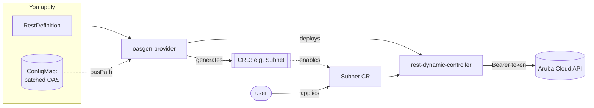
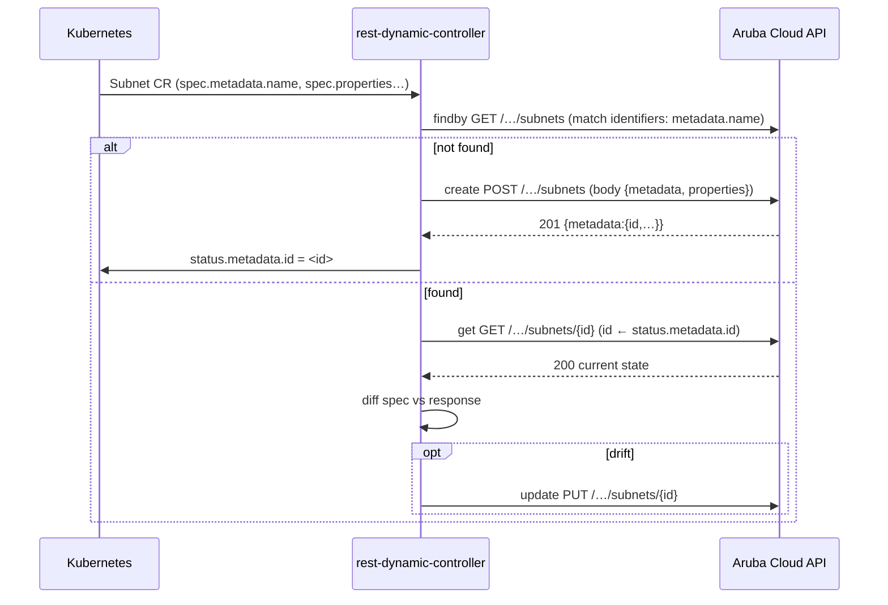
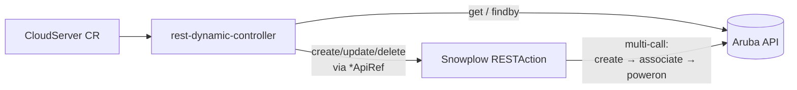

# Architecture

## Components

| Component | Role |
|-----------|------|
| **oasgen-provider** | Watches `RestDefinition` objects; from the referenced OpenAPI document it **generates a CRD** for the resource and **deploys a controller** to reconcile instances |
| **rest-dynamic-controller (RDC)** | The generated controller; reconciles each Custom Resource by calling the Aruba API with the verbs declared in the RestDefinition |
| **RestDefinition** | The single source of truth: which OAS, which resource `kind`, which endpoints map to findby/get/create/update/delete, identifiers, config fields |
| **ConfigMap** | Holds the patched OAS document referenced by `oasPath: configmap://…` |
| **`<Kind>Configuration`** | Per-kind auth + per-verb query configuration, referenced by each CR via `spec.configurationRef` |
| **Snowplow RESTAction** | Multi-call orchestration for lifecycles that are not plain CRUD (see [lifecycle-beyond-crud](lifecycle-beyond-crud.md)) |

## From RestDefinition to a working controller



1. You apply the ConfigMap (patched OAS) and the RestDefinition.
2. oasgen-provider reads the OAS, generates the `Subnet` CRD and a `SubnetConfiguration` CRD, and deploys an RDC instance for it.
3. The RestDefinition reaches `Ready` once the CRD is installed and the controller is up.
4. You apply a `SubnetConfiguration` (auth) and a `Subnet` CR; the RDC reconciles it against the Aruba API.

## Reconcile flow (a metadata-wrapped resource)



## The metadata pattern (why there is no proxy)

Almost every Aruba resource nests its name and id inside a `metadata` object:

```
create body:  { metadata: { name, location, tags }, properties: { … } }
read body:    { metadata: { id, name, … }, status: { state }, properties: { … } }
```

The old blueprint shipped a Go proxy solely to flatten `metadata`. oasgen-provider
handles it declaratively:

- `identifiers: [metadata.name]` — a **nested** identifier;
- `additionalStatusFields: [metadata.id]` — lifts the server id into `status`;
- `requestFieldMapping: [{inPath: id, inCustomResource: status.metadata.id}]` on
  get/update/delete — feeds the `{id}` path parameter from status.

See [adding-a-resource](adding-a-resource.md) for the exact rules and
[oasgen-provider-evolution](oasgen-provider-evolution.md) §B1 for the history.

## Lifecycle beyond CRUD

Resources whose lifecycle is multi-call or action-driven (chiefly
`compute/CloudServer`) delegate their mutating verbs to Snowplow RESTActions via
`createApiRef`/`updateApiRef`/`deleteApiRef`, keeping observe native:



Full detail in [lifecycle-beyond-crud](lifecycle-beyond-crud.md).
